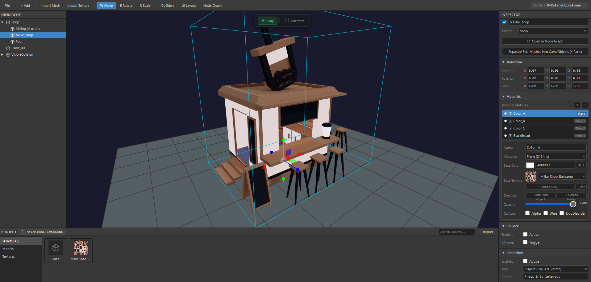
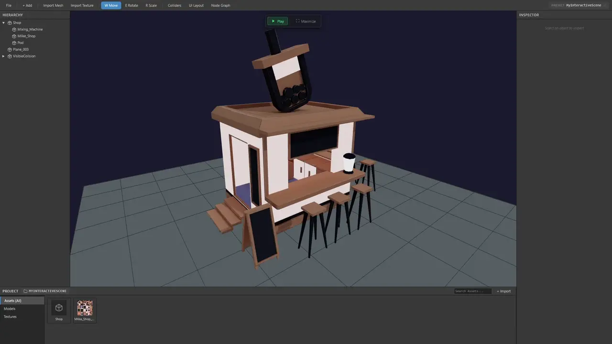
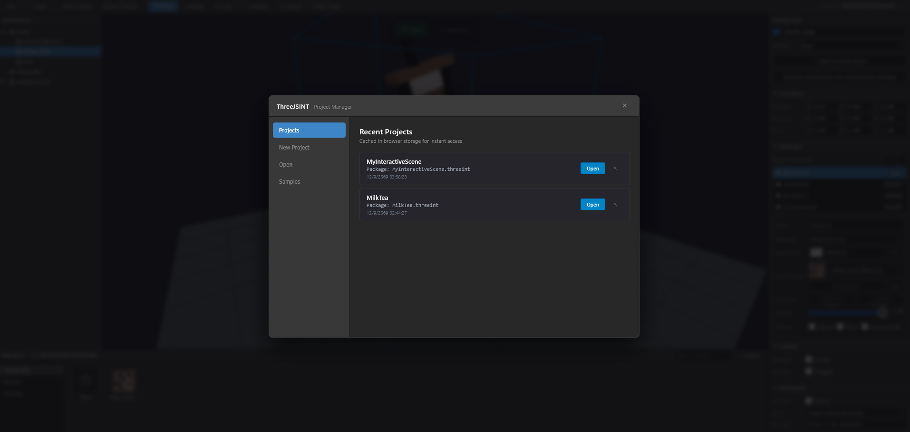

# ThreeJSINT Engine

ThreeJSINT is a lightweight, browser-based 3D interactive game engine and scene authoring environment built on Three.js. Designed with a professional Unity and Unreal Engine interface philosophy, ThreeJSINT provides an end-to-end game creation workflow directly inside the browser—allowing creators to assemble 3D environments, manage multi-material meshes, configure collision volumes and trigger zones, script game logic with a visual node graph, design custom 2D HUDs, test in real-time first-person mode, and export standalone single-file HTML builds or deployable packages with zero external dependencies.

---

## Screenshots

### 1. Scene Editor & Viewport

*Dark game engine layout featuring Scene Hierarchy, 3D Viewport with Floating Play HUD, Transform Controls, Material Slots, Inspector, and Assets Project Panel.*

### 2. Standalone Exported Runtime (FPS Mode)

*Exported standalone interactive build running in first-person mode with crosshair, collision physics, and raycast interaction prompts.*

### 3. Project Launcher & Template Manager

*Built-in project hub managing cached browser projects, packages (.threeint / .zip), and starter templates.*

---

## Key Features

- **Professional Game Engine Interface**: Clean dark theme with crisp 1px borders, collapsible inspector sections, category-filtered asset browser, and a top-center floating viewport HUD.
- **Dual-Mode Workflow (Edit & Play)**:
  - **Edit Mode**: Fly camera navigation, multi-axis transform gizmos (Translate, Rotate, Scale), object selection, and live parameter tuning.
  - **Play Mode**: First-person controller with Pointer Lock mouse look, WASD movement, jumping, sprinting, collision resolution, and raycast interaction.
- **Instant Browser Storage Architecture**:
  - **Save (`Ctrl + S`)**: Commits the scene graph, asset cache, UI layout, and node logic directly to browser IndexedDB/LocalStorage. Instantaneous with no file download prompts.
  - **Save As (`Ctrl + Shift + S`)**: Exports a self-contained `.threeint` package archive to your computer.
  - **Project Name Badge**: Clickable toolbar and asset header breadcrumbs to rename projects and sync names instantly across the workspace.
- **Asset Pipeline**:
  - Drag-and-drop or file picker importing for 3D models (`.glb`, `.gltf`) and textures (`.png`, `.jpg`, `.webp`).
  - Blender-style Material Slots (`+` add, `-` remove) with per-submesh assignment and texture mapping overrides (diffuse, normal, roughness, metalness).
  - Deduplicated serialization preserving submesh groups and hierarchy.
- **Physics & Collision Solver**:
  - Discrete Axis-Aligned Bounding Box (AABB) sliding plane collision solver.
  - Solid colliders to block player movement and trigger volumes for event zones.
  - Visual wireframe toggle (cyan for solid colliders, green for triggers).
- **Interactive First-Person Controller**:
  - Pointer Lock controls with mouse look sensitivity, head-bob, and sprint.
  - Raycast interaction prompt (`E` key) and 3D item inspection with focus and drag-rotation overlay.
  - Virtual joystick and touch controls for mobile browsers.
- **Visual Node Graph**:
  - Node-based visual scripting system with Events, Conditions, and Actions for game logic without writing code.
- **2D UI Canvas Designer**:
  - In-engine WYSIWYG UI designer for HUDs, dialogue boxes, crosshairs, and custom counters.
- **One-Click Export**:
  - **Standalone HTML**: 100% self-contained single-file HTML with all meshes and textures embedded in Base64. Double-click to run offline or host statically.
  - **Deployable ZIP**: Ready-to-host web package with structured assets and clean HTML5 player.

---

## Quick Start

### 1. Run with any Static Web Server

No build steps, compilers, or `node_modules` are required. Serve the project root directory using any local HTTP server:

```bash
# Using Node.js live-server:
npx live-server .

# Or using Python 3:
python -m http.server 8080

# Or using PHP:
php -S localhost:8080
```

Open your browser at `http://localhost:8080` (or `http://127.0.0.1:8080`).

### 2. Loading Preconfigured Demos

To bypass the launcher and load directly into a prebuilt demonstration scene:

```
http://localhost:8080/?demo=treasure-room
```

---

## How to Use: Step-by-Step Guide

### Step 1: Project Management & Saving

| Action | Shortcut / Location | Description |
| :--- | :--- | :--- |
| **Save Project** | `Ctrl + S` or `File → Save Project` | Saves scene, assets, UI, and logic into browser IndexedDB/LocalStorage. Instantaneous and does not trigger file downloads. |
| **Save Project As** | `Ctrl + Shift + S` or `File → Save Project As (.threeint)...` | Prompts for a new project name, bundles assets into a portable `.threeint` package, and downloads it to your computer. |
| **Rename Project** | Click `Project: [Name]` on Toolbar | Prompts for a new name and commits it to local storage without downloading a file. |
| **Open Project** | `File → Open Project (.threeint / .json)...` | Loads any saved `.threeint` package, `.zip` archive, or legacy `.json` project file. |
| **Project Launcher** | `File → Project Launcher...` | Displays recent projects cached in browser storage and starter templates. |

---

### Step 2: Adding & Transforming Objects

1. **Add Primitives**: Click `+ Add` in the top toolbar to create a **Cube**, **Sphere**, **Plane**, or **Cylinder**.
2. **Import Custom 3D Models**:
   - Click `Import Mesh` in the toolbar or `+ Import` in the bottom Project panel.
   - Select a `.glb` or `.gltf` file from your disk.
   - The model will appear in the **Project Assets** panel. Drag it into the 3D Viewport to instantiate it.
3. **Select Objects**: Click any mesh directly in the 3D Viewport or click its entry in the **Hierarchy** panel.
4. **Transform Shortcuts**:
   - `W`: Move / Translate gizmo
   - `E`: Rotate gizmo
   - `R`: Scale gizmo
   - `F`: Focus camera on selected object
   - `Delete` / `Backspace`: Delete selected object

---

### Step 3: Material Slots & Texture Overrides

1. Select a mesh in the scene.
2. In the **Inspector** panel on the right, locate the **Material Slots** section:
   - Click `+` (Add Material Slot) to create a new material slot.
   - Click `-` (Remove Selected Material Slot) to delete the active slot.
   - Click any slot in the list to select it and adjust its base color, roughness, metalness, and wireframe mode.
3. Under **Texture Overrides**, click **Browse** next to Diffuse, Normal, Roughness, or Metalness to attach imported texture assets.

---

### Step 4: Setting Up Collisions & Triggers

1. Select an object in the scene.
2. In the **Inspector**, expand the **Collider** section:
   - Check **Active** to generate an Axis-Aligned Bounding Box (AABB) for the object.
   - **Solid Collider** (`Trigger: OFF`): Blocks player movement (floors, walls, pillars).
   - **Trigger Zone** (`Trigger: ON`): Allows player passage while emitting collision enter and exit events (doorways, pickup zones, checkpoints).
3. Click `Colliders` in the toolbar to toggle wireframe collision boxes in the viewport (cyan for solid, green for trigger).

---

### Step 5: Configuring Interactive Objects

1. Select the object you want the player to interact with.
2. Ensure its **Collider** is enabled with **Trigger** checked.
3. Expand the **Interaction** section in the Inspector:
   - Check **Active**.
   - **Type**:
     - `Inspect (Focus & Rotate)`: Opens a 360-degree inspection overlay where the player can rotate and inspect the item with the mouse.
     - `Custom Trigger`: Fires interaction events into the Node Graph.
   - **Prompt**: Text shown to the player when crosshair hovers over the item (e.g., `Press E to inspect Relic`).
   - **Distance**: Maximum interaction raycast range in world units (default: `3.0`).

---

### Step 6: Visual Scripting with Node Graph

1. Click `Node Graph` in the toolbar to open the visual logic workspace.
2. Right-click on the graph canvas or click `+ Add Node` to create logic nodes:
   - **Events**: `On Start`, `On Interact`, `On Trigger Enter`, `On Trigger Exit`, `On Key Pressed`.
   - **Conditions**: `Compare Variable`, `Has Item`, `Check Distance`.
   - **Actions**: `Toggle Object`, `Play Sound`, `Set Variable`, `Show UI`, `Teleport Player`.
3. Drag between node output and input ports to connect execution and data wires.
4. Changes in the graph take effect immediately when testing in Play mode.

---

### Step 7: Designing In-Game 2D UI & HUD

1. Click `UI Layout` in the toolbar to open the 2D UI Designer overlay.
2. Add HUD elements from the left panel:
   - **Text / Labels**: Objective markers, dialogue text, item descriptions.
   - **Buttons**: Clickable on-screen UI buttons.
   - **Panels / Cards**: Background cards for health, inventory, or dialogue boxes.
   - **Crosshair**: Custom center-screen aiming reticles.
3. Position and style elements using percentage or pixel coordinates, font sizes, colors, and opacity.
4. Elements can be hidden or revealed dynamically via Node Graph actions.

---

### Step 8: Playtesting & Controls

1. Click **Play** on the floating HUD at the top center of the viewport (or press `F5`).
2. Click inside the 3D Viewport to engage **Pointer Lock**.
3. **Desktop Controls**:
   - `W`, `A`, `S`, `D`: Walk forward / backward / strafe
   - `Shift`: Sprint
   - `Space`: Jump
   - `Mouse`: Look around
   - `E`: Interact with targeted objects
   - `ESC`: Unlock mouse cursor / Stop play mode
4. **Maximize on Play**: Click the `Maximize` button in the floating HUD to expand the game view to full window dimensions during playtesting.
5. **Mobile Controls**: On touch devices, virtual joystick and touch-look zones automatically activate.

---

### Step 9: Exporting Your Game

1. Open the `File` dropdown menu on the toolbar:
   - **Export Standalone HTML** (`File → Export Standalone HTML`):
     Creates a single, self-contained `.html` file embedding Three.js runtime, 3D models, textures, UI, and logic scripts in Base64. Can be double-clicked and played directly from the local hard drive without a web server.
   - **Export Deployable Package** (`File → Export Deployable Package (.zip)`):
     Creates a production `.zip` containing `index.html` and a structured `assets/` directory, ready to deploy to GitHub Pages, Netlify, Vercel, AWS S3, or any static host.

---

## Keyboard Shortcuts Cheat Sheet

| Shortcut | Action | Scope |
| :--- | :--- | :--- |
| `Ctrl + S` | Save Project locally to browser storage (IndexedDB) | Global |
| `Ctrl + Shift + S` | Save Project As (export `.threeint` package file) | Global |
| `W` | Activate Move / Translate Gizmo | Edit Mode |
| `E` | Activate Rotate Gizmo | Edit Mode |
| `R` | Activate Scale Gizmo | Edit Mode |
| `F` | Focus Camera on Selected Object | Edit Mode |
| `Delete` / `Backspace` | Delete Selected Object | Edit Mode |
| `F5` / Play Button | Toggle Play Mode | Viewport |
| `ESC` | Unlock Cursor / Exit Play Mode | Play Mode |
| `WASD` | Walk / Strafe Movement | Play Mode |
| `Shift` | Sprint | Play Mode |
| `Space` | Jump | Play Mode |
| `E` | Raycast Interaction with Object | Play Mode |

---

## Project Directory Layout

```
ThreeJSINT/
├── index.html                     # Editor entry point with Three.js import maps
├── Demo.html                      # Exported standalone sample interactive build
├── README.md                      # Complete documentation and user guide
├── Implementation.md              # Technical architecture specification
├── css/
│   └── editor.css                 # Engine dark theme and layout stylesheets
├── js/
│   ├── app.js                     # Editor initialization and query router
│   ├── engine/                    # Core runtime engine (shared by editor & exports)
│   │   ├── Renderer.js            # Three.js WebGL renderer and canvas management
│   │   ├── SceneManager.js        # Scene hierarchy, serialization, deduplication
│   │   ├── AssetManager.js        # Model and texture loaders, Base64 parsers
│   │   ├── CollisionSystem.js     # Discrete AABB physics solver and trigger manager
│   │   ├── FPSController.js       # First-person pointer lock controller
│   │   ├── MobileControls.js      # On-screen virtual joystick and touch look
│   │   ├── InteractionSystem.js   # Raycast interaction detection and prompt system
│   │   ├── ItemInspector.js       # 360-degree item inspection overlay
│   │   ├── Primitives.js          # Procedural geometry factory (Cube, Sphere, Plane...)
│   │   ├── ProjectFileSystem.js   # IndexedDB caching, package bundling (.threeint)
│   │   ├── UIManager.js           # In-game HUD element renderer
│   │   └── NodeGraph/             # Visual scripting execution runtime
│   └── editor/                    # Authoring tools (omitted from exported builds)
│       ├── EditorMain.js          # Main coordinator managing edit and play modes
│       ├── Toolbar.js             # Top toolbar and floating viewport play HUD
│       ├── Hierarchy.js           # Scene tree panel with parenting support
│       ├── Inspector.js           # Property sheets, material slots, colliders
│       ├── ProjectPanel.js        # Asset browser with category filtering
│       ├── ProjectLauncher.js     # Project manager modal (recent & templates)
│       ├── Gizmo.js               # Three.js TransformControls manager
│       ├── NodeGraphEditor.js     # Visual node graph editor UI
│       ├── UIPanel.js             # 2D HUD drag-and-drop designer
│       └── ExportSystem.js        # Single-file HTML and ZIP bundle packager
├── demo/
│   └── treasure-room.json         # Prebuilt demo project scene and assets
└── screenshots/
    ├── editor_overview.png        # Screenshot of the editor interface
    ├── demo_runtime.png           # Screenshot of the exported game
    └── launcher_overview.png      # Screenshot of the project manager
```

---

## Technical Specifications

- **Rendering Engine**: Three.js (r128+ compatible via ES Module import maps).
- **Physics**: Discrete AABB sliding plane collision solver with multi-pass sub-stepping.
- **3D Asset Formats**: Standard GL Transmission Format binary (`.glb`, `.gltf`).
- **Texture Formats**: PNG, JPEG, WebP.
- **Browser Compatibility**: Edge, Chrome, Firefox, Safari, and mobile browsers supporting WebGL 2.0 and Pointer Lock API. No build dependencies, compilers, or bundlers required.
